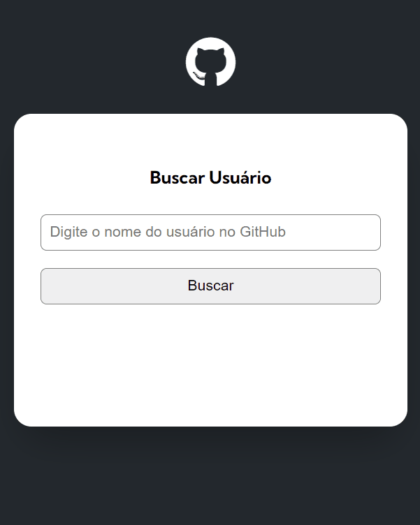
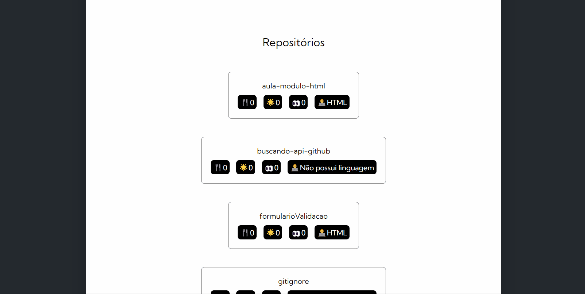
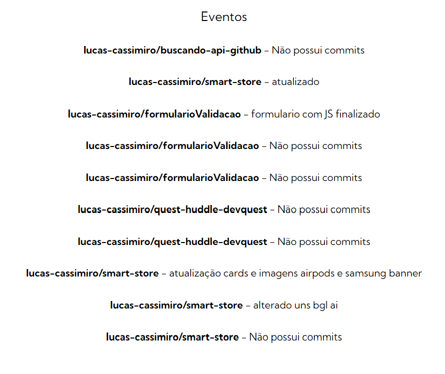

<h1 align="center"><strong>Projeto GitHub API</strong></h1>

Este projeto é o resultado de um desafio do módulo de JavaScript avançado proposto pelo curso de desenvolvimento front-end DevQuest. Ele consiste em um campo de busca no qual deve ser inserido o nome do usuário cujo perfil se deseja consultar. Ao clicar no botão "Buscar" ou na tecla "Enter", o sistema faz uma busca utilizando a API do GitHub.

 

<h2>🌐 Visão Geral do Projeto</h2>

No gif a seguir, uma demonstração do projeto ao fazer uma busca do meu perfil.

 

<h2>🧑‍💻 Perfil do usuário</h2>

Na primeira seção do resultado da busca, há a foto do perfil do usuário. Ao lado, o nome em negrito, uma descrição da sua bio - caso não haja, será renderizado o aviso de ausência de bio -, seguida pelos números de Seguidores (<i>followers</i>) e de Seguindo (<i>follows</i>).

 

<h2>📱Responsivo</h2>

Versão Mobile

 

<h2>📄 Repositórios</h2>

Na seção de Repositórios, temos uma lista de elementos que contém o nome do repositório, bem como algumas das suas características destacadas nos ícones pretos. Estes ícones representam as quantidades de 🍴<i>forks</i>, ⭐<i>stars</i> e 👀<i>watchings</i> que aquele repositório obteve, além também da principal 🧑‍💻ferramenta aplicada naquele projeto. Ao clicar no elemento, o usuário que faz a busca é redirecionado para a página que contém o repositório clicado.

 

<h2>🎆Eventos</h2>

Na última seção do resultado de busca, há uma lista dos eventos realizados no perfil do usuário e o último commit de cada evento. A mensagem ao lado informará em caso de não haver commits naquele evento. Ao clicar em um deles, o usuário também será redirecionado para o repositório correspondente.

 

<h2>🛠️ Ferramentas Utilizadas</h2>

- HTML
- CSS
- JavaScript
- [GitHub API](https://docs.github.com/pt/rest?apiVersion=2022-11-28)

💻 Page do projeto -  [Projeto GitHub API](https://lucas-cassimiro.github.io/buscando-api-github/)

🙋‍♂️ Perfil no LinkedIn - [Lucas Cassimiro](https://www.linkedin.com/in/lucasocassimiro/)